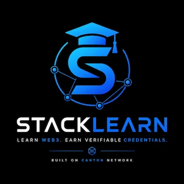

# StackLearn

<p align="center">
  
</p>

<p align="center">
<b>Learn • Build • Earn</b><br>
Community-driven Web3 education platform focused on practical learning, collaboration, and open knowledge.
</p>

<p align="center">
<a href="https://stacklearnhq.github.io/stacklearn/">🌐 Website</a> •
<a href="https://github.com/stacklearnhq/stacklearn">GitHub</a> •
<a href="https://x.com/stacklearnhq">X</a> •
<a href="https://discord.gg/9TkBNTGvR">Discord</a> •
<a href="https://t.me/stacklearnhq">Telegram</a>
</p>

---

# 📖 About

StackLearn is an open community initiative that makes Web3 education practical, accessible, and collaborative.

Instead of focusing only on theory, StackLearn encourages people to learn by building real projects, contributing to open source, and growing together with the community.

---

# ✨ Features

* 📚 Practical Web3 learning
* 🛠 Project-based education
* 🤝 Community collaboration
* 🌍 Open knowledge sharing
* 📱 Fully responsive design
* ⚡ Fast loading experience
* 🔍 SEO optimized
* ♿ Accessibility focused

---

# 🚀 Live Website

https://stacklearnhq.github.io/stacklearn/

---

# 📊 Lighthouse Score

| Category         |   Score |
| ---------------- | ------: |
| 🚀 Performance   |  **98** |
| ♿ Accessibility  | **100** |
| ✅ Best Practices | **100** |
| 🔍 SEO           | **100** |

---

# 🛠 Tech Stack

* HTML5
* CSS3
* Vanilla JavaScript
* GitHub Pages

---

# 📂 Project Structure

```
stacklearn/
│
├── assets/
│   ├── stacklearn-logo.webp
│   ├── og-banner.webp
│   ├── favicon-32x32.png
│   ├── favicon-16x16.png
│   ├── apple-touch-icon.png
│   ├── site.webmanifest
│
├── css/
│   └── style.css
│
├── js/
│   └── script.js
│
├── index.html
├── robots.txt
├── sitemap.xml
└── README.md
```

---

# 🎯 Core Values

* Learn by Building
* Open Knowledge
* Community First

---

# 🛣 Roadmap

* ✅ Responsive Website
* ✅ Mobile Navigation
* ✅ Hero Animation
* ✅ Statistics Section
* ✅ Scroll Reveal Animation
* ✅ SEO Optimization
* ✅ Open Graph Support
* ✅ Structured Data
* ✅ Lighthouse Optimization

Future plans:

* Learning Resources
* Community Programs
* Practical Guides
* Ecosystem Partnerships

---

# 🤝 Contributing

Contributions are welcome.

If you would like to improve StackLearn:

1. Fork this repository.
2. Create a new feature branch.
3. Commit your changes.
4. Open a Pull Request.

---

# 📄 License

This project will be released under the MIT License.

---

# ❤️ Author

**Jenal Aripin**

Built with passion for education, open source, and the Web3 community.
