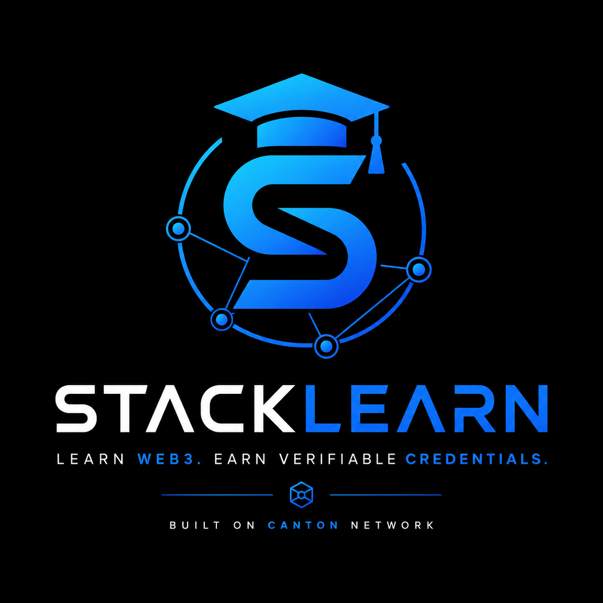

  

<h1 align="center">StackLearn</h1>

Learn • Build • Earn in Web3

A community-driven platform dedicated to Web3 education, practical learning, and verifiable credentials.

⸻

📖 About StackLearn

StackLearn is a community-driven Web3 education initiative focused on helping learners develop practical blockchain knowledge and real-world skills.

Our mission is to simplify access to Web3 education through open resources, collaborative learning, and transparent documentation. We believe meaningful learning comes from building, experimenting, and contributing to open ecosystems.

Whether you are just beginning your Web3 journey or expanding your technical knowledge, StackLearn aims to provide a welcoming environment where everyone can learn, build, and grow together.

⸻

✨ Features

* 📚 Practical Web3 learning resources
* 🤝 Community-driven collaboration
* 🛠️ Hands-on skill development
* 🌐 Open documentation and knowledge sharing
* 🚀 Participation in the Canton ecosystem
* 🔗 Verifiable learning journey (future vision)
